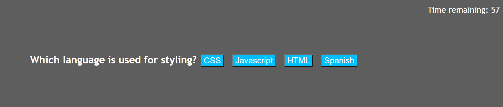

# Code-Quiz

## Description
I made this application to gain a better understanding of practical uses of JavaScript, and because quizzes are a popular way to waste time on the internet. Testing people's coding knowledge is a worthwile task. In the process of building this application, I learned a lot about how JavaScript interacts with HTML and CSS, and how to build multiple complicated functions that interact with each othe. JavaScript can be an extremely powerful tool when used correctly.

Link to deployed application: https://gjguerin96.github.io/Code-Quiz/ 

## Usage
The application has a start button, and once the user clicks it the timer will start and the first question will be displayed. Each question has 4 choices (see screenshot). If the user answers wrong, the timer will decrease by 10 seconds. Each time they answer a question, the next question is displayed until either the timer reaches 0 or the user has answered all questions. The user recieves a final score of the time they had left when the game ended, and is prompted to enter their initials to save their score.

    
## Credits
I recieved some assistance and advice from my classmates, my instructor Will Vasquez, and my tutor Vinnie Lopez. I also watched a video from the YouTube channel WebDevSimplified for some guidance on my Javascript.

## License
Copyright (c) 2021 Gabriel Guerin

Permission is hereby granted, free of charge, to any person obtaining a copy of this software and associated documentation files (the "Software"), to deal in the Software without restriction, including without limitation the rights to use, copy, modify, merge, publish, distribute, sublicense, and/or sell copies of the Software, and to permit persons to whom the Software is furnished to do so, subject to the following conditions:

The above copyright notice and this permission notice shall be included in all copies or substantial portions of the Software.

THE SOFTWARE IS PROVIDED "AS IS", WITHOUT WARRANTY OF ANY KIND, EXPRESS OR IMPLIED, INCLUDING BUT NOT LIMITED TO THE WARRANTIES OF MERCHANTABILITY, FITNESS FOR A PARTICULAR PURPOSE AND NONINFRINGEMENT. IN NO EVENT SHALL THE AUTHORS OR COPYRIGHT HOLDERS BE LIABLE FOR ANY CLAIM, DAMAGES OR OTHER LIABILITY, WHETHER IN AN ACTION OF CONTRACT, TORT OR OTHERWISE, ARISING FROM, OUT OF OR IN CONNECTION WITH THE SOFTWARE OR THE USE OR OTHER DEALINGS IN THE SOFTWARE.
